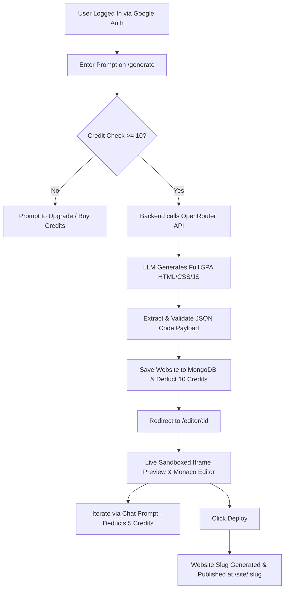

# Dora AI — AI-Powered Website Builder

A full-stack web application that generates production-grade, responsive single-page websites (SPA) from natural language prompts using AI LLM models via OpenRouter, React 19, Monaco Editor, Express, MongoDB, Firebase Auth, and Razorpay payment integration.

---

## Overview

### What the Project Does
**Dora AI** is an intelligent web design and development platform. Users provide text prompts describing their desired website, and the platform generates fully functional, single-file responsive websites (HTML, CSS, and JavaScript) in real time.

### What Problem It Solves
Creating landing pages, portfolio sites, or business web pages manually requires extensive design work, front-end boilerplate, and setup time. Dora AI eliminates this friction by generating production-ready layouts with modern UI, mobile responsiveness, Unsplash media integration, interactive components, and instant public hosting links in seconds.

### Why It Was Built
Dora AI was built to demonstrate an end-to-end AI SaaS architecture—combining prompt engineering, streaming code updates, integrated code editing, sandboxed iframe previews, credit-based usage monetization, and automated website deployment.

### Who Would Find It Useful
- **Developers & Designers**: To quickly prototype landing pages and UI concepts.
- **Entrepreneurs & Startup Founders**: To generate launch pages and marketing sites without coding.
- **Freelancers & Marketers**: To create client demos and responsive landing pages rapidly.

---

## Key Features

- 🪄 **Prompt-to-Website Generation**: Turn plain English prompt descriptions into complete, fully responsive single-page applications with multi-section navigation (Home, About, Services, Contact).
- 💬 **Iterative AI Refinement**: Refine and update existing designs using natural language chat (e.g., *"Change primary color to emerald green"*, *"Add a testimonials carousel"*).
- 💻 **Monaco Code Editor Integration**: Embedded VS Code-powered Monaco Editor for viewing and directly tweaking the generated HTML, CSS, and JS code.
- 👁️ **Live Dual-Pane Sandboxed Preview**: Instant hot reload of generated code inside a sandboxed `iframe` with seamless viewport testing.
- 🚀 **One-Click Instant Deployment**: Deploys websites with custom slug URLs (`/site/:slug`) accessible to any public visitor without server setup.
- 🔐 **Google OAuth Authentication**: Secure authentication via Firebase Auth and JWT stored in HTTP-Only cookies.
- 🪙 **Credit-Based Monetization System**: Automated credit management deducting credits per site generation (10 credits) and refinement edit (5 credits).
- 💳 **Razorpay Payment Gateway**: Integrated checkout system for topping up credits across Free, Pro, and Enterprise tiers with cryptographic HMAC SHA256 payment signature verification.
- 📂 **Workspace Dashboard**: Dashboard interface to manage, edit, preview, deploy, and share links for all created websites.

---

## Tech Stack

### Frontend
| Technology | Description |
| :--- | :--- |
| **React 19** | Modern UI framework with concurrent features |
| **Vite 7** | Next-generation frontend build tool and dev server |
| **Tailwind CSS v4** | Utility-first styling framework |
| **Monaco Editor** | (`@monaco-editor/react`) Visual Studio Code code editor component |
| **Framer Motion** | (`motion`) Smooth UI micro-animations and page transition effects |
| **Lucide React** | Modern icon set |
| **Redux Toolkit & Persist** | Application state management and local state persistence |
| **React Router v7** | Client-side routing for SPA navigation |
| **Firebase Auth** | Google OAuth popup authentication |
| **Axios** | Promise-based HTTP client |

### Backend
| Technology | Description |
| :--- | :--- |
| **Node.js & Express v5** | Server-side JavaScript runtime and RESTful API framework |
| **MongoDB & Mongoose v9** | NoSQL database and Object Data Modeling (ODM) library |
| **OpenRouter API** | Integration with LLMs (`google/gemma-4-31b-it:free`) for code generation |
| **Razorpay SDK** | Payment gateway integration for credit purchases |
| **JSON Web Token (JWT)** | Cookie-based session authentication (`cookie-parser`) |
| **Security Middleware** | `helmet` for security headers, `express-rate-limit` for rate limiting |

---

## How It Works



1. **Authentication**: User logs in via Google popup powered by Firebase. The backend receives user credentials, creates or updates the MongoDB `User` record, and returns a 7-day HTTP-Only JWT cookie.
2. **Generation**: The user enters a site concept (or chooses from pre-made prompt presets). The backend verifies credit balance, formats the prompt using a Master System Prompt, and queries the OpenRouter API.
3. **Parsing & Storage**: The AI returns raw JSON containing the generated code. The backend parses the payload, validates structural integrity, saves the website in MongoDB, deducts 10 credits from the user, and returns the site ID.
4. **Editing & Iteration**: The user enters the `/editor/:id` view. The code is rendered inside a sandboxed `iframe` using `URL.createObjectURL`. The user can either edit raw HTML in Monaco Editor or type chat requests to instruct the AI to update code (costing 5 credits per edit).
5. **Deployment**: Clicking *Deploy* assigns a URL-friendly slug to the website and sets `deployed: true`. The live page is rendered dynamically for public visitors under `/site/:slug`.
6. **Payments**: Users can purchase credits on the `/pricing` page via Razorpay modal checkout. Upon payment completion, backend HMAC SHA256 signature verification grants credits to the user account.

---

## Project Structure

```
DORA_AI/
├── vercel.json                  # Root Vercel SPA rewrite configuration
├── README.md                    # Project documentation
│
├── backend/                     # Express.js REST API Server
│   ├── config/                  # Configuration files
│   │   ├── db.js                # Mongoose database connection
│   │   ├── openRouter.js        # OpenRouter API fetch wrapper
│   │   ├── plan.js              # Subscription plan definitions & credit rates
│   │   └── razorpay.js          # Razorpay instance configuration
│   ├── controllers/             # Request handlers
│   │   ├── authController.js    # Google OAuth login & logout
│   │   ├── paymentController.js # Razorpay order creation & HMAC verification
│   │   └── websiteController.js # AI generation, update, deploy & retrieval logic
│   ├── database/                # Database connection helper
│   ├── middlewares/             # Custom express middleware
│   │   └── isAuthenticated.js  # JWT authentication verification middleware
│   ├── models/                  # Mongoose Schemas
│   │   ├── userModel.js         # User schema (credits, plan, OAuth profile)
│   │   ├── websiteModel.js      # Website schema (latestCode, conversation, slug)
│   │   └── paymentModel.js      # Payment history & order status schema
│   ├── routes/                  # Express route definitions
│   │   ├── authRoute.js         # /api/auth routes
│   │   ├── paymentRoute.js      # /api/payment routes
│   │   └── websiteRoute.js      # /api/website routes
│   ├── utils/                   # Utility helpers
│   │   └── extractJson.js       # Robust AI JSON response extractor
│   ├── index.js                 # Server entry point & Express configuration
│   ├── package.json             # Backend dependencies & scripts
│   └── sample.env               # Sample backend environment variables
│
└── frontend/                    # Vite + React 19 Client Application
    ├── public/                  # Static assets
    ├── src/                     # React source files
    │   ├── assets/              # Static media assets
    │   ├── components/          # Reusable UI components
    │   │   ├── LoginModal.jsx   # Google sign-in modal
    │   │   └── Navbar.jsx       # Main navigation header
    │   ├── lib/                 # Utility helpers (shadcn / clsx)
    │   ├── pages/               # Page views
    │   │   ├── Dashboard.jsx    # User website portfolio dashboard
    │   │   ├── Generate.jsx     # AI website generation wizard
    │   │   ├── Home.jsx         # Landing page hero & showcase
    │   │   ├── LiveSite.jsx     # Public deployed site viewer (/site/:slug)
    │   │   ├── Pricing.jsx      # Credit plan purchase view
    │   │   └── WebsiteEditor.jsx# Dual-pane code editor & iframe preview
    │   ├── redux/               # Redux state slices
    │   │   ├── store.js         # Redux store with persist reducer
    │   │   └── userSlice.js     # User state slice
    │   ├── App.jsx              # React Router view setup
    │   ├── firebase.js          # Firebase Auth initialize App & provider
    │   ├── index.css            # Global CSS & Tailwind CSS directives
    │   └── main.jsx             # Client entry point
    ├── package.json             # Frontend dependencies & scripts
    ├── sample.env               # Sample frontend environment variables
    └── vite.config.js           # Vite server & build setup
```

---

## Installation

### Prerequisites
Ensure you have the following installed on your local system:
- **Node.js**: `v18.0.0` or higher
- **npm**: `v9.0.0` or higher
- **MongoDB**: Local MongoDB server instance or MongoDB Atlas connection string
- **OpenRouter API Key**: API key from [OpenRouter](https://openrouter.ai/)
- **Firebase Project**: Firebase App configured with Google Authentication enabled
- **Razorpay Account**: Razorpay test key ID and Secret for payments

### Step 1: Clone the Repository
```bash
git clone https://github.com/Deadstroke-25/DoraAI--Website-Builder.git
cd DoraAI--Website-Builder
```

### Step 2: Configure Environment Variables

#### Backend (`backend/.env`)
Create a `.env` file inside the `backend` directory based on `backend/sample.env`:
```env
PORT=8000
MONGO_URI=mongodb+srv://<username>:<password>@cluster.mongodb.net/doraai
SECRET_KEY=your_jwt_secret_key
OPENROUTER_API_KEY=sk-or-v1-your-openrouter-key
FRONTEND_URL=http://localhost:5173
RAZORPAY_KEY_ID=rzp_test_your_key_id
RAZORPAY_SECRET=your_razorpay_secret
```

#### Frontend (`frontend/.env`)
Create a `.env` file inside the `frontend` directory based on `frontend/sample.env`:
```env
VITE_SERVER_URL=http://localhost:8000
VITE_FIREBASE_API_KEY=your_firebase_api_key
VITE_RAZORPAY_KEY_ID=rzp_test_your_key_id
```

### Step 3: Install Dependencies

#### Install Backend Dependencies:
```bash
cd backend
npm install
```

#### Install Frontend Dependencies:
```bash
cd ../frontend
npm install
```

---

## Usage

### 1. Start the Backend Server
```bash
cd backend
npm run dev
```
*The Express server will start listening at `http://localhost:8000`.*

### 2. Start the Frontend Application
```bash
cd frontend
npm run dev
```
*The Vite application will launch at `http://localhost:5173`.*

### 3. Workflow Steps
1. Open `http://localhost:5173` in your web browser.
2. Click **Sign In** and authorize via Google OAuth.
3. Click **+ New Website** or go to `/generate`.
4. Enter a detailed prompt or choose a preset prompt (e.g., *Tech Startup*, *Design Agency*, *SaaS Platform*, *E-Commerce*).
5. Wait for the AI generation process to complete (10 credits deducted).
6. In the **Website Editor** (`/editor/:id`):
   - Switch between **Preview** and **Code** mode (Monaco Editor).
   - Use the side chat panel to submit modifications (5 credits deducted).
   - Click **Deploy** to generate a live link.
7. Access deployed sites via `/site/:slug`.
8. Check credits balance or buy additional credit packs on `/pricing`.

---

## Screenshots / Demo

*(Add project screenshots or GIF walkthroughs below)*

| Landing Page | Generation Wizard |
| :---: | :---: |
|  |  |

| Dual-Pane Editor & Preview | User Dashboard |
| :---: | :---: |
|  |  |

---

## Architecture

The project follows a decoupled **Client-Server Architecture**:

```
[ React Client (Vite) ]
        │
        ├── Auth ─────────► [ Firebase Google OAuth ]
        │
        ├── REST API ─────► [ Express.js Backend (Port 8000) ]
        │                           │
        │                           ├── Mongoose ────► [ MongoDB Atlas ]
        │                           │
        │                           ├── Fetch ───────► [ OpenRouter API ]
        │                           │                  (Gemma 4 31B IT)
        │                           │
        │                           └── SDK ─────────► [ Razorpay API ]
        │
        └── Deployed Sites ─► [ Iframe srcDoc / Blob Render ]
```

- **Authentication**: JWT tokens stored in HTTP-Only, SameSite cookies with cookie-based authorization header fallbacks.
- **Code Generation Engine**: System prompts enforce strict constraints—single-file output (HTML + CSS `<style>` + JS `<script>`), responsive breakpoint rules, Unsplash image URL formatting, and raw JSON returns.
- **Security & Rate Limiting**: Backend applies `helmet` for header security and `express-rate-limit` (10 auth requests / 15 min; 100 API requests / 15 min).

---

## Results / Output

Websites generated by Dora AI possess the following characteristics verified by codebase enforcement:

- **Single-File Executable SPA**: Standard HTML document containing inline `<style>` and `<script>` blocks compatible with `iframe srcdoc` rendering.
- **Responsive Layout**: Mobile-first grid and flexbox styling with media query breakpoints (`<768px`, `768px-1024px`, `>1024px`).
- **Dynamic Content & Unsplash Integration**: Pre-formatted high-resolution photography placeholders sourced from `images.unsplash.com` with auto-crop params (`?auto=format&fit=crop&w=1200&q=80`).
- **Client-Side SPA Routing**: Vanilla JS navigation enabling section transitions without full page reloads.

---

## Future Improvements

- [ ] **Multi-File Project Export**: Support zip export containing separate `.html`, `.css`, and `.js` files.
- [ ] **Custom Domain Binding**: Allow pro users to link custom domain names to deployed slugs.
- [ ] **Version History & Rollback**: Track snapshot history of previous iterations to restore older versions.
- [ ] **Visual Drag-and-Drop Inspector**: Direct element selection and visual style editing alongside AI prompts.
- [ ] **Template Starter Library**: Categorized gallery of pre-built prompts and community-shared layout starters.

---

## Limitations

- **Single-File Output Constraint**: The AI prompt generator enforces all HTML, CSS, and JavaScript into a single raw JSON response payload.
- **External Dependency on LLM**: Generation speed and output quality are dependent on OpenRouter model response times and availability (`google/gemma-4-31b-it:free`).
- **Sandboxed Iframe Boundaries**: Generated scripts run inside a sandboxed iframe (`allow-scripts allow-same-origin allow-forms`), restricting access to parent frame window APIs.
- **Fixed Credit Pricing Rules**: Generation costs a fixed 10 credits and updates cost 5 credits regardless of prompt length or modification complexity.

---

## License

No explicit top-level license file is currently provided in this repository. Backend components specify the **ISC License** in `backend/package.json`. Please refer to the repository owner for permissions regarding reuse and distribution.